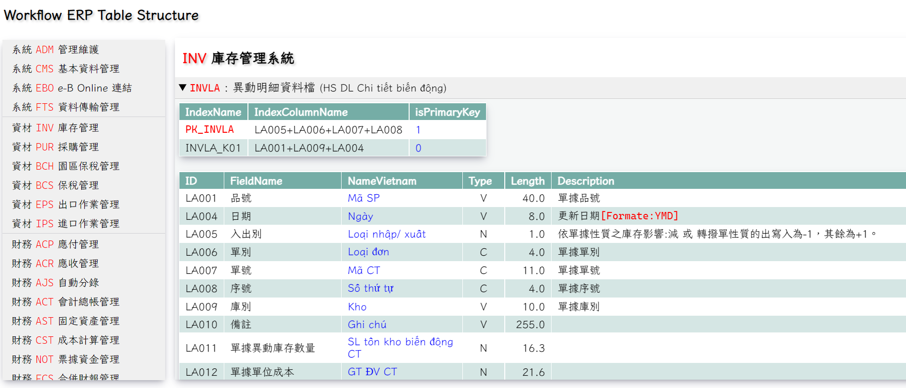

# Workflow ERP Database Structure 
# (頂捷 易飛 Workflow ERP 資料結構)

## 目的：

每次想查看 Workflow ERP 的資料結構 (ERP 提供的 Help 檔案)，實在是有點麻煩。
而且還很多資料並不在 Help 檔案內。例如：ADM 和 DSC 模組。

加入越南語部分，主要是方便 越南同事 使用。

## 畫面：



## 使用：

1. 只要下載 
    index.html
    df_style.css
    和 **HTML** 整個資料夾

2. 使用瀏覽器，打開 index.html 即可

## 作法：

1. **mssql_to_json.py**

    **使用 Python pymssql：**
    從 SQL Server 的 DSCSYS.ADMMA、 DSCSYS.ADMMC、 DSCSYS.ADMMD，SELECT 相關資料，處理+分別儲存在 MoudleName.json、TableName.json、TableStructure.json
    
    ```
    # -- 建立 MSSQL 連線
    conn = pymssql.connect(server=SERVER_IP, user=USERNAME, password=PASSWORD, database=DATABASE)
    cursor = conn.cursor()
    cursor.execute(SQLString)
    ```
    另外，TableStructure.json 的 Description 內容，還要修整一些不需要的內容。
    例如：
        - 去除 // 和 && 後面的資料。
        - 很多 Description 的內容，和 Field Name 一樣。

2. **FieldNameConvert2utf8.py**

   從 SQL Server 中取得的 TableStructure.json 資料，有很多 Table 的欄位內容都是亂碼。
   ( Field Name = ADMMD.MD004 和 Description = ADMMD.MD007)
    
    ```
    # -- 轉換 iso-8859-1 to big5
    def Convert_iso8859_to_big5(string):
        s = str(string)
        s = s.encode('iso-8859-1').decode('csbig5')
        return s        
    ```
3. **CreateIndexHtml.py**
   
   建立主畫面 index.html。

4. **CreateTableStructureHtml.py**

    依照各模組，各自建立 Table Structure 的畫面
